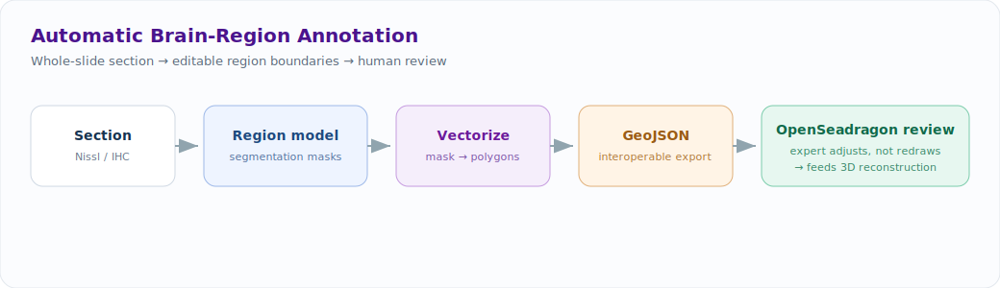
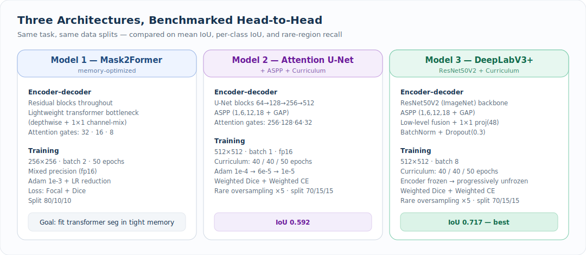
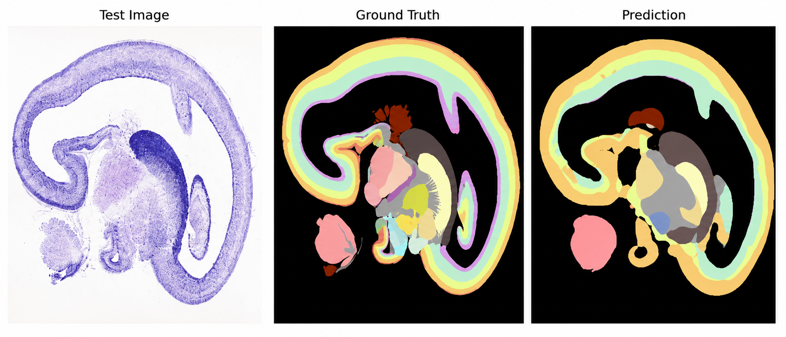
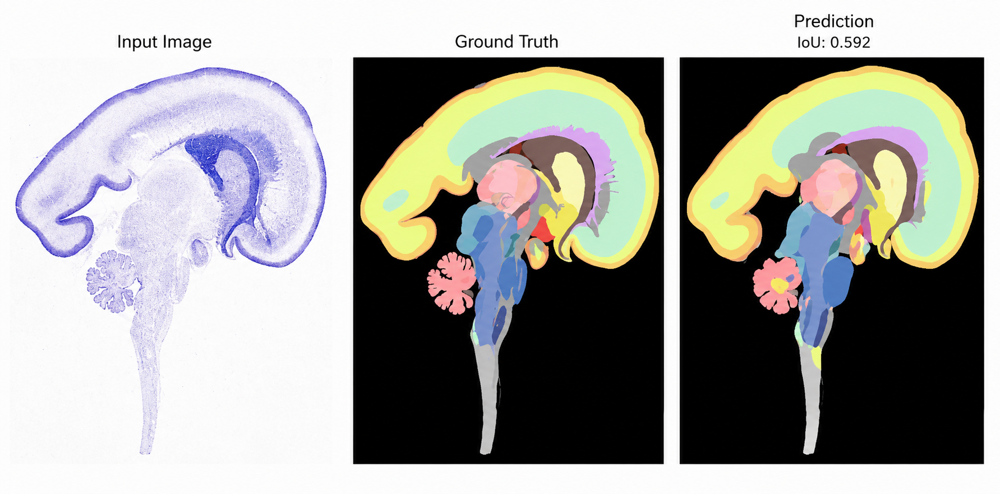
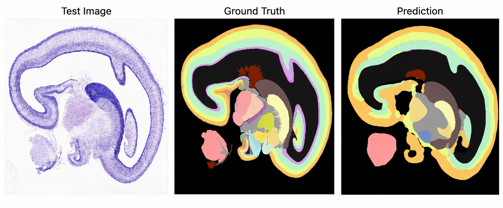

# Automatic Annotation of Brain Regions

  
  
  
  
  
  

> Built at the **Sudha Gopalakrishnan Brain Centre, IIT Madras**, on serial whole-brain histology. This repo documents the method and an in-progress model-selection study; source is held under institutional IP.

> **⚠️ Status — work in progress.** The goal here is the *workflow*, not a finished model. Current models already produce usable first-pass region proposals; accuracy is actively being improved (more annotated data, better long-tail handling, post-processing). The numbers below are **current baselines on the path up**, not final results.

---

## The goal: cut the manual annotation burden

A single brain in the archive is reconstructed from **~10,000 serial sections**, and every section has to be partitioned into anatomical regions (cortical plate, white matter, sub-plate, ventricular zones, and many finer structures). Done by hand, this is the **single most labor-intensive step** in the brain-mapping program — slow, costly in expert hours, and inconsistent between annotators.

**The primary objective of this project is to reduce that manual labor, time, and effort.** Instead of an expert drawing every region boundary from scratch on every section, the model produces a first-pass region map the expert only has to **review and adjust** — converting hours of manual tracing per section into minutes of correction. Raw accuracy is secondary to that workflow win: even an imperfect model that gets the expert 80% of the way there is a large net time saving across thousands of sections.

That framing — **labor saved, not leaderboard score** — is the lens for everything below, and it's why this is shipped as a human-in-the-loop assist rather than a fully autonomous segmenter.

## System overview

A section is preprocessed, a region model predicts a dense multi-class map, the raster map is vectorized to polygons and exported as **GeoJSON**, and a neuroanatomist refines the proposal in an **OpenSeadragon** deep-zoom viewer. The reviewed regions feed the centre's downstream **3D reconstruction** pipeline.

## Model-selection study *(ongoing)*

Rather than commit to one architecture early, three strong segmentation families are being trained on the **same task and data splits** and compared on mean IoU, per-class IoU, and rare-region behaviour. This is the disciplined part: a defensible, measured direction — not a single lucky run — and an honest baseline to improve against. The exploration is still active; results below reflect the current iteration.

| Model | Backbone / core idea | Input | Loss | Result |
|---|---|---|---|---|
| **1 · Mask2Former** *(memory-optimized)* | Residual encoder–decoder + lightweight transformer bottleneck | 256² | Focal + Dice | qualitative — see Fig. 1 |
| **2 · Attention U-Net** *(+ ASPP + curriculum)* | Attention-gated U-Net + ASPP | 512² | Weighted Dice + Weighted CE | **IoU 0.592** |
| **3 · DeepLabV3+** *(+ curriculum)* | ResNet50V2 (ImageNet) + ASPP | 512² | Weighted Dice + Weighted CE | **IoU 0.717 — best** |

**Takeaway so far:** transfer learning from an ImageNet-pretrained ResNet50V2 backbone (Model 3), with curriculum learning and multi-scale ASPP context, currently gives the most stable region maps — and, importantly, ones that are **already good enough to seed expert review** rather than redrawing from scratch. The transformer model (Model 1) was engineered primarily to make attention-based segmentation **fit in constrained GPU memory**, and the attention-U-Net (Model 2) validated the curriculum + class-balancing strategy. These are working baselines; the next iterations target higher accuracy on rare regions.

---

### Model 1 — Mask2Former (memory-optimized)

A transformer-augmented encoder–decoder tuned to run under tight memory.

- **Architecture** — `Conv 7×7(32) + MaxPool` → stacked **residual blocks** (32 → 64 → 128) with an attention-gated decoder (gates at 32, 16, 8) and skip connections; **bottleneck** = 2 residual blocks + a **lightweight transformer** (depthwise conv + 1×1 channel-mixing) for global context; final `Upsample + Conv 1×1 + Softmax`.
- **Training** — 256×256 input, batch 2, 50 epochs, **mixed precision (fp16)**, Adam (1e-3) + LR reduction, **Focal + Dice** loss, residual learning throughout for stable optimization. Split 80/10/10.
- **Metrics** — IoU, Dice, pixel accuracy, classification accuracy.

Fig. 1 — Test image · ground truth · prediction (Region Segmentation Model 1).

### Model 2 — Attention U-Net + ASPP + Curriculum

- **Architecture** — encoder conv-blocks 64 → 128 → 256 → 512 with MaxPool; **ASPP** (rates 1, 6, 12, 18 + global average pooling) at the bridge; **attention-gated** transpose-conv decoder (gates 256, 128, 64, 32); final `Conv 1×1 + Softmax`.
- **Curriculum learning** — three phases (40 / 40 / 50 epochs) with the learning rate annealed Adam **1e-4 → 6e-5 → 1e-5**; early stopping + LR reduction.
- **Class imbalance** — regions tiered by frequency (**Tier 1 ≥ 50, Tier 2 10–49, Tier 3 < 10**), rare classes **oversampled ×5**; **Weighted Dice + Weighted Sparse CE**. Invalid image/mask pairs removed. 512×512, batch 1, fp16, split 70/15/15.
- **Metrics** — mean IoU, per-class IoU, pixel accuracy, explicit **rare-class bias monitoring**.

Fig. 2 — Input · ground truth · prediction, **IoU 0.592** (Region Segmentation Model 2).

### Model 3 — DeepLabV3+ + ResNet50V2 + Curriculum  *(best)*

- **Architecture** — **ResNet50V2 (ImageNet-pretrained)** backbone; low-level features from `conv2_block3_1_relu` (128² × 256) fused with high-level `conv4_block6_1_relu` (32² × 1024); **ASPP** (1, 6, 12, 18 + GAP) → 32² × 256; decoder = bilinear upsample + 1×1 projection(48) + concat + `Conv-BN-ReLU(256)` + Dropout(0.3) + bilinear upsample + `Conv 1×1 + Softmax`.
- **Transfer learning + curriculum** — encoder **frozen in Phase 1**, then **progressively unfrozen** across phases (40 / 40 / 50 epochs) for stable fine-tuning; Adam **1e-4 → 6e-5 → 1e-5**.
- **Class imbalance** — regions tiered by pixel area (**Tier 1 ≥ 5000 px, Tier 2 500–4999 px, Tier 3 < 500 px**), rare classes **oversampled ×5**; **Weighted Dice + Weighted Sparse CE**. 512×512, batch 8, split 70/15/15.
- **Metrics** — mean IoU, per-class IoU, pixel accuracy, rare-class bias monitoring.

Fig. 3 — Input · ground truth · prediction, **IoU 0.717** (Region Segmentation Model 3).

---

## Engineering rigor (what actually made it work)

- **Long-tail anatomy is the real problem.** Rare regions dominate the error budget, so every model uses frequency/area **tiering + ×5 oversampling + class-weighted loss**, and tracks **per-class IoU and rare-class bias** rather than hiding behind a single mean.
- **Curriculum learning** stabilized the harder 512² models — easy/common structure first, rare structure later — instead of letting the loss collapse onto the dominant background classes.
- **Reproducible protocol** — fixed splits, deterministic preprocessing (16-bit TIFF → RGB float, RGB masks → class-index masks, invalid pairs removed), and the same metric suite across all three models, so the comparison is fair.
- **Memory-aware design** — mixed precision throughout; Model 1 specifically re-engineers a transformer segmenter to run within constrained GPU memory.

## Production path

- **Editable output** — predictions are vectorized to polygons and exported as **GeoJSON**, the interoperable annotation standard, so they drop into existing review tooling.
- **Human-in-the-loop** — boundaries render in **OpenSeadragon** for pan/zoom review; the expert *adjusts* rather than *redraws* — the throughput unlock.
- **Feeds 3D reconstruction** — consistent per-section regions are the input to volumetric whole-brain assembly.

## Tech stack

`PyTorch / TensorFlow-Keras` · `Mask2Former · Attention U-Net · DeepLabV3+ (ResNet50V2)` · `ASPP` · `mixed precision` · `shapely / GeoJSON` · `OpenSeadragon` · `FastAPI`

## Roadmap — what's next

- **More annotated sections** to lift accuracy, especially on rare/fine regions.
- **Better long-tail handling** beyond oversampling (e.g. boundary-aware and region-aware losses).
- **Post-processing** — CRF / morphological cleanup and polygon smoothing for cleaner editable boundaries.
- **Quantify the time saved** — measure expert minutes-per-section *with vs. without* the assist, the metric that actually matters for this project.

## Why it matters

This is an early but disciplined attempt at the most expensive step in a brain-mapping program: **the manual annotation bottleneck**. The aim isn't a state-of-the-art leaderboard number — it's a working **human-in-the-loop assist** that turns hours of expert tracing into minutes of review. The engineering approach is what a product/research team would want to see in an in-progress effort: a controlled architecture comparison, explicit handling of the long-tail that breaks naive segmenters, reproducible training, and honest baselines (current best **mIoU 0.717**) on a clear trajectory of improvement.

---

Code and trained weights are private under IIT Madras / SGBC institutional agreements. A technical walkthrough is available on request.
